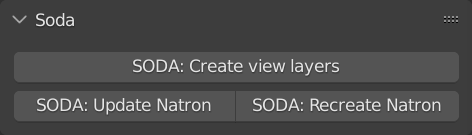
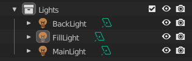
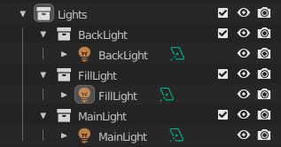
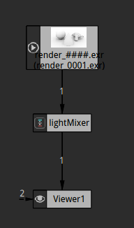
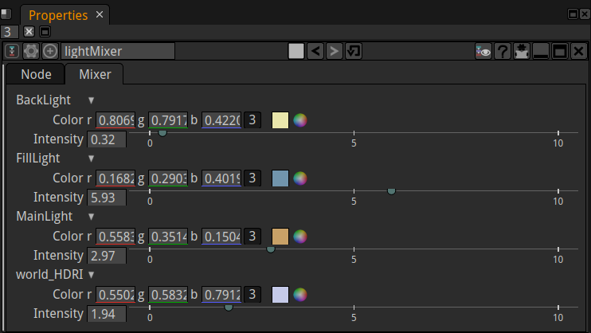
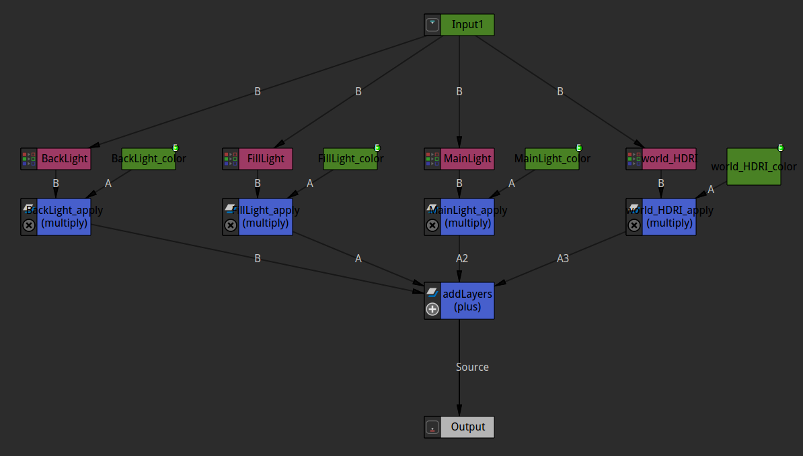

# Soda

A [Natron](https://natrongithub.github.io/) compositing project generator for [blender](https://www.blender.org/).

## Usage

The add-on adds a new panel to the output tab of the property editor.

It consists only of 2 actions to trigger. The first one prepares the blender scene to render a layer for each light
in the scene. The second one launches Natron and sets up a comp, that allows to tweak each light layer individually
and thus adjust the lighting without re-rendering.

## Workflow
### Preparing the scene

The "SODA: Create view layers" action prepares the blender scene. In blender only collections can be enabled or disabled
for specific view layers. Thus this add-on ensures, that each light is within its own collection.
Basically it rearranges the following scene-graph:

into this:

It then creates specific view-layers and enables for each one the respective light, while turning all others off. A
specific view-layer will be created for the world HDRI. A blender-side compositing network is also being created in
order to save out a multi-layer exr file containing all light layers with their respective naming.

### Rendering

Rendering happens with the usual workflow in blender. Just press F12 to render an image.

### Going to Natron

Clicking on "SODA: Start Natron" will launch Natron. The executable needs to be specifies in the add-on preferences.
If this is done, this button will start a new Natron instance, and setup the following compositing graphs:

The middle node is a customized group node, providing a light mixer interface:

Each available light provides each a color and intensity tweaker, so adjusting the lighting won't need jumping around to
different nodes. Everything is available within this parameter interface.

Internally the light mixing is realized by a little group internal compositing graph:

Unfortunately Natron opens with this group open, so one should switch to the main compositing graph.

> ### Note:
>
> If the community scripts for Natron are being installed, this add-on won't work. The reason why and how to
> get both playing nicely along with each other is still work in progress. It seems, that Natron when loading 
> the community scripts changes some behavior of the embedded python interpreter. So triggering the project
> setup script breaks, while it works if the community scripts are not installed.

*Happy compositing*