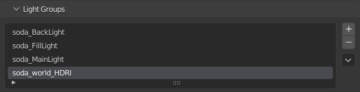

# Soda

A [Natron](https://natrongithub.github.io/) compositing project generator for [blender](https://www.blender.org/).

## Usage

The add-on adds a new panel to the output tab of the property editor.


It consists only of 2 actions to trigger. The first one prepares the blender scene to define a light group for each
light in the scene. The second one launches Natron and sets up a comp, that allows to tweak each light layer
individually and thus adjust the lighting without re-rendering. For the second action it's possible to choose to update
an existing comp (Update Natron) or to create a completely new comp (Recreate Natron).
When updating an existing comp, the add-on searches for a Natron file in the directory specified for compositing from
the preferences. The Natron project then needs to be named according to the blender scene. Version numbers are searched
backwards until an existing version is being found. So if your blender scene is called ```myHouse03.blend```, the add-on
searches for ```myHouse03.ntp```, ```myHouse02.ntp```, ```myHouse01.ntp```, ```myHouse00.ntp```
and ```myHouse.ntp``` in that order. If one of these Natron projects is being found, this is being loaded and updated.

## Workflow
### Preparing the scene

The "SODA: Create light groups" action prepares the blender scene. This add-on ensures, that each light is captured
within its own light group. Basically the following scene-graph:


results in the definition of the following light groups:



A specific light group will also be created for the world HDRI. A blender-side compositing network is also being created
in order to save out a multi-layer exr file containing all light layers with their respective naming.

### Rendering

Rendering happens with the usual workflow in blender. Just press F12 to render an image.

### Going to Natron

Clicking on "SODA: Start Natron" will launch Natron. The executable needs to be specifies in the add-on preferences.
If this is done, this button will start a new Natron instance, and setup the following compositing graphs:


The middle node is a customized group node, providing a light mixer interface:


Each available light provides each a color and intensity tweaker, so adjusting the lighting won't need jumping around to
different nodes. Everything is available within this parameter interface.

Internally the light mixing is realized by a little group internal compositing graph:


Unfortunately Natron opens with this group open, so one should switch to the main compositing graph.

> ### Note:
>
> If the community scripts for Natron are being installed, this add-on won't work. The reason why and how to
> get both playing nicely along with each other is still work in progress. It seems, that Natron when loading 
> the community scripts changes some behavior of the embedded python interpreter. So triggering the project
> setup script breaks, while it works if the community scripts are not installed.

*Happy compositing*